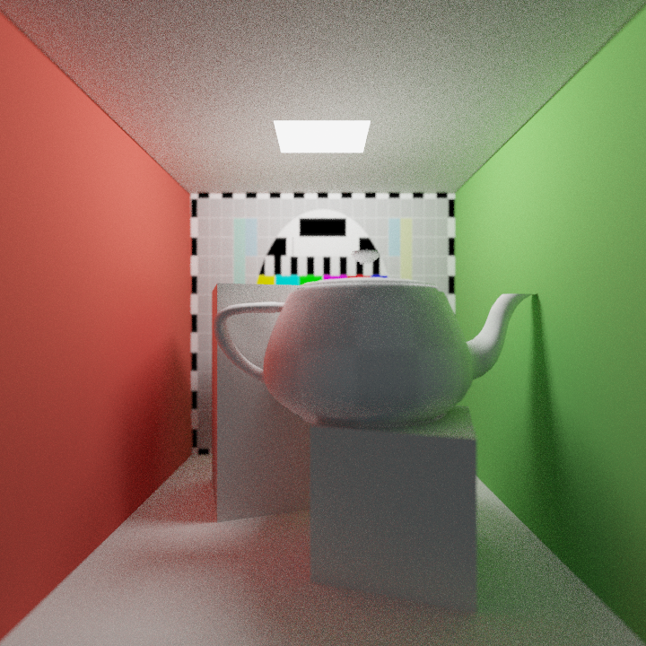
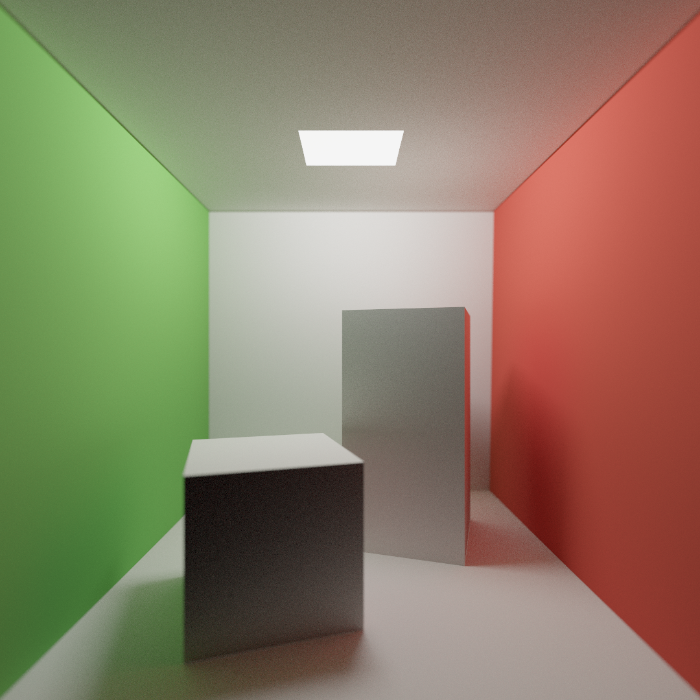
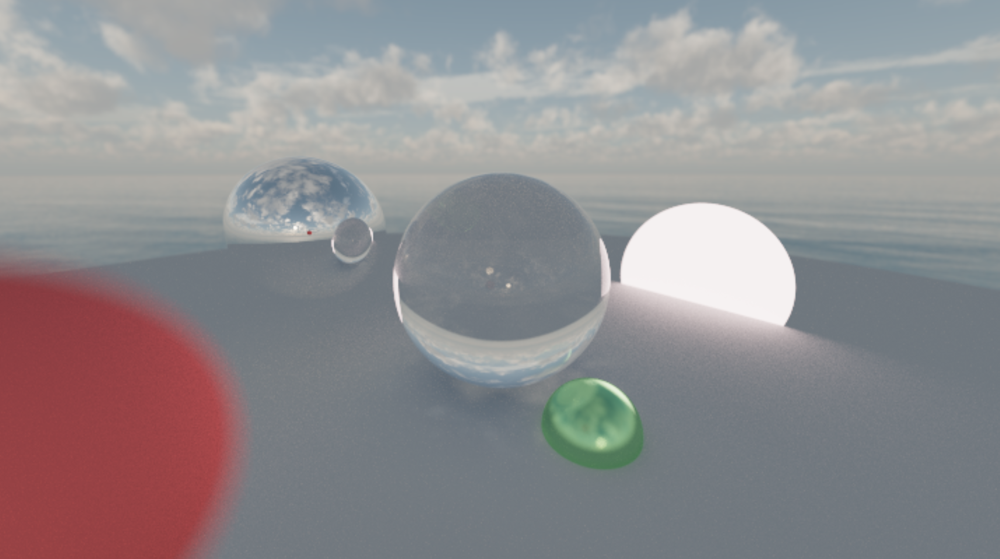
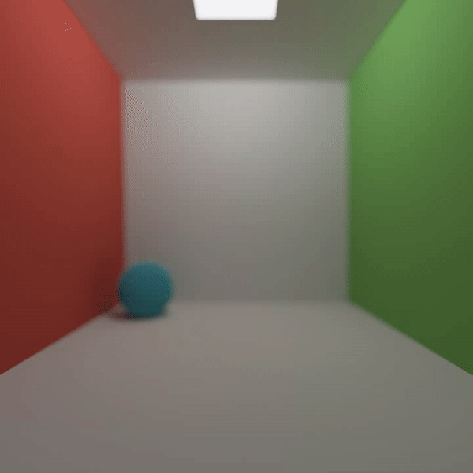
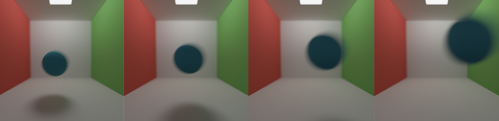

Traceratops
===========

A very basic CPU path tracer. It was mostly developed for the purpose of learning how it works, so in terms of performance & nice-to-have features not much has been done.

Most of this project was written during an 8 week course, and not much was done after the course ended, so some features (most notably microfacet BRDF importance sampling) were never finished. With that said, here is a list of features:

## Technical features

- .obj model loading & rendering (including textures)
- Custom bounding volume hierarchy (BVH)
- A tile-job parallel renderer which utilizes all available CPU cores
- Progressive rendering

## Features with accompanying images

_Soft shadows, depth of field, global illumination through brute force path tracing_

_Transparency, mirror reflections, depth of field, environment mapping_

_Motion blur & animations (by exporting an image sequence)_

_A microfacet BRDF (top: metal, bottom: dielectric), however I never got around to implement importance sampling so it's very noisy at low roughness_

### License

Copyright 2017-2018 Simon Moos

Permission is hereby granted, free of charge, to any person obtaining a copy of this software and associated documentation files (the "Software"), to deal in the Software without restriction, including without limitation the rights to use, copy, modify, merge, publish, distribute, sublicense, and/or sell copies of the Software, and to permit persons to whom the Software is furnished to do so, subject to the following conditions:

The above copyright notice and this permission notice shall be included in all copies or substantial portions of the Software.

THE SOFTWARE IS PROVIDED "AS IS", WITHOUT WARRANTY OF ANY KIND, EXPRESS OR IMPLIED, INCLUDING BUT NOT LIMITED TO THE WARRANTIES OF MERCHANTABILITY, FITNESS FOR A PARTICULAR PURPOSE AND NONINFRINGEMENT. IN NO EVENT SHALL THE AUTHORS OR COPYRIGHT HOLDERS BE LIABLE FOR ANY CLAIM, DAMAGES OR OTHER LIABILITY, WHETHER IN AN ACTION OF CONTRACT, TORT OR OTHERWISE, ARISING FROM, OUT OF OR IN CONNECTION WITH THE SOFTWARE OR THE USE OR OTHER DEALINGS IN THE SOFTWARE.
